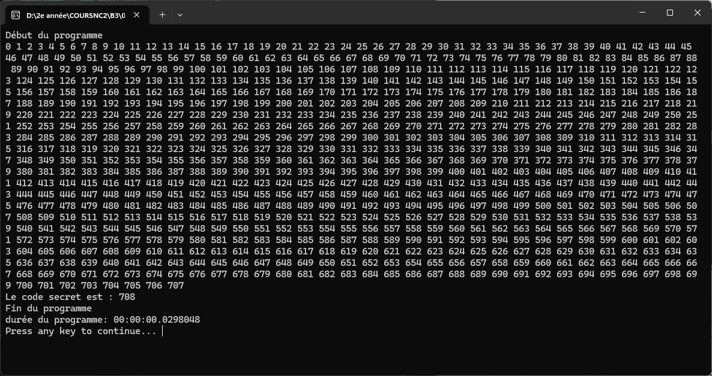

# TP - 06. SLAM - CSharp - Casser Code PIN

**Nom :** Emma-Gabrielle FOUGEROUX 
**Classe :** BTS SIO SLAM 2 
**Date :** 15/09/2026

---

## Mission 2 : Calculer le temps d'exécution d'un programme

### Questions & Réponses
---

- **Que fait le programme dans cet état ?**

    Il affiche successivement "Début du programme" puis "Fin du programme" de manière instantanée, sans effectuer aucun calcul ou traitement entre les deux, avant d'attendre qu'une touche soit pressée pour se fermer.

- **Quelle est la durée de ce programme en secondes ?**

    0 seconde

- **En millisecondes (ms) ?**

    Environ 12 millisecondes (12,07 ms)

---

## Mission 4 : Force brute

### Questions & Réponses
---

- **Résultat (fournissez une impression écran)**

    

      
    

    
<em>Figure 1 : Exécution de l'attaque par force brute (Mission 4)</em>

- **Quelle est la durée de ce programme en secondes ?**

    0 seconde (environ 0,03 s / 30 ms)

---

## Mission 5 : Temporisation

### Questions & Réponses
---

- **Relancez le programme. Quelle est sa durée ?**

    La durée est d'environ 25 secondes.

- **Lancez le programme : quel est l’effet sur l’attaquant ?**

    L'effet sur l'attaquant est dissuasif : l'attaque par force brute devient extrêmement lente et impraticable en conditions réelles :
    - **Sans délai :** tester 10 000 combinaisons prend une fraction de seconde (< 0,1 s).
    - **Avec 5 ms de délai :** le parcours complet prend jusqu'à 50 secondes ($10\,000 \times 0{,}005\text{ s}$).
  
    - **Avec 1 seconde (1 000 ms) de délai :** tester l'ensemble des combinaisons prendrait jusqu'à **10 000 secondes, soit environ 2 heures et 46 minutes**. L'attaque en ligne perd toute viabilité, d'autant plus si un verrouillage de compte ou un blocage d'adresse IP intervient après quelques échecs.
